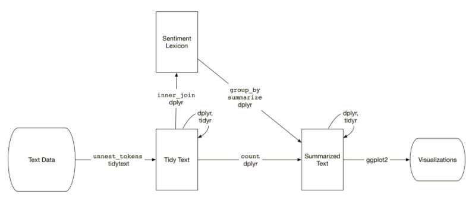
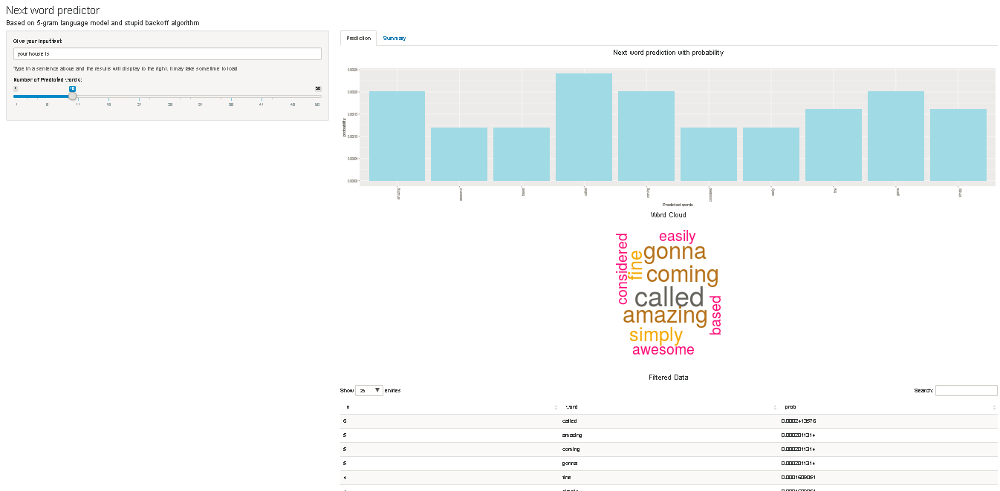

Next word predictor based on stupid backoff ngram model
========================================================
author: Vineet Jaiswal
date: 24-Dec-2017
autosize: true

Final presentation for Data Science Specialization from Johns Hopkins University

========================================================
## Introduction 

A Shiny app that takes as input a phrase (multiple words) in a text box input and outputs a prediction of the next word.

## Data cleaning, sampling  and analysis 
* Once analyse the data then found its too big to process 
* Take a medium size  sample from all three input files and mix them for final sample which represent overall picture 
* Clean the data before any moving to next docker i.e. remove punctuation, control, digits, non-ASCII characters and make all the text in lower case

========================================================
## n-gram model creation 

* Used tidy text format for n-gram creation 
* The same model can be easily used for Sentimental creation/NLP needs in next releases 

* Once n-gram model created then stored the model in csv file, so once we will run it on Shiny app then it will not process from start which will increase performance multiple folds

========================================================
## Stupid backoff implementation and Shiny App

* In Stupid Backoff, we use the 5-gram if we have enough data points to make it seem credible, otherwise if we don't have enough of a 5-gram count, we back-off and use the 4-gram, till we reached to unigram
* Less expensive than Katz backoff and gives better accuracy, 

========================================================
## Important links

* Shiny App : https://vineet.shinyapps.io/next-word-predictor-csv/
* GIT code base : https://github.com/jaiswalvineet/jaiswalvineet.github.io

## Appendix 
* N-Gram, Speech and Language Processing, https://web.stanford.edu/~jurafsky/slp3/
* N-Gram creation, https://www.tidytextmining.com/
* Stupid backoff explained, http://www.aclweb.org/anthology/D07-1090.pdf
* Katzs Backoff Model Implementation, https://thachtranerc.wordpress.com/2016/04/12/katzs-backoff-model-implementation-in-r/
* Discounting methods: Part 1 - Katz Bigram, https://www.youtube.com/watch?v=hsHw9F3UuAQ
